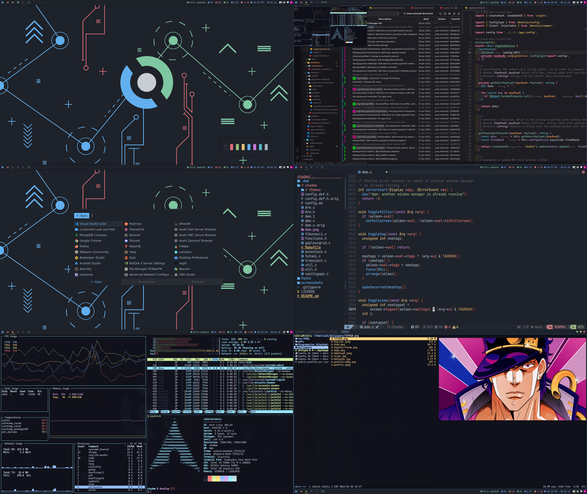

<h1 align="center">🌌 Chadwm</h1>

<p align="center">
  <a href="https://dwm.suckless.org/">dwm</a> configuration for a productive development with beautiful ui/ux
</p>



<br/>

## Requirements

- dash (shell)
- imlib2
- xsetroot package ( status2d uses this to add colors on dwmbar)
- JetbrainsMono Nerd Font (or any nerd font) and Material design icon font

## Setup

```
cd ~/.config
git clone git@github.com:NikolaM-Dev/chadwm.git
cd chadwm/chadwm
sudo make clean install
```

- Copy the stuff from fonts folder to your ~/.local/share/fonts

## Run chadwm

Run the autostart file from .xinitrc

(.xinitrc file)

```sh
#!/bin/sh

exec ~/.config/chadwm/chadwm/./autostart.sh
```

OR

Create a desktop entry

```sh
touch /usr/share/xsessions/chadwm.desktop
```

```sh
[Desktop Entry]
Encoding=UTF-8
Name=Chadwm
Comment=Dynamic window manager
Exec=~/.config/chadwm/chadwm/./autostart.sh
Icon=dwm
Type=XSession
```

## Wallpaper

- [chad](https://github.com/NikolaM-Dev/chadwm/blob/main/wallpapers/chad-23-01-22.png)

## Recompile

- You need to recompile dwm after every change you make in its src code

```
cd ~/.config/chadwm/chadwm
sudo make clean install
```

## Change themes

- Chadbar : in bar.sh
- Chadwm : in config.def.h

## Credits

- [**eProTaLT3**](https://www.reddit.com/user/eProTaLT83)
- **@fitrh**
- [**siduck**](https://github.com/siduck)

## Patches

- barpadding
- bottomstack
- cfacts
- dragmfact
- dragcfact (took from [bakkeby's build](https://github.com/bakkeby/dwm-flexipatch))
- fibonacii
- gaplessgrid
- horizgrid
- movestack
- vanity gaps
- colorful tags
- statuspadding
- status2d
- underline tags
- notitle

## ©️ Copyright

**`LICENSE`**

Check the file [here](./LICENSE)

<p align="center">⌨️ with ❤️ by <a href="https://github.com/NikolaM-Dev"><strong>NikolaM-Dev</strong><a></p>
